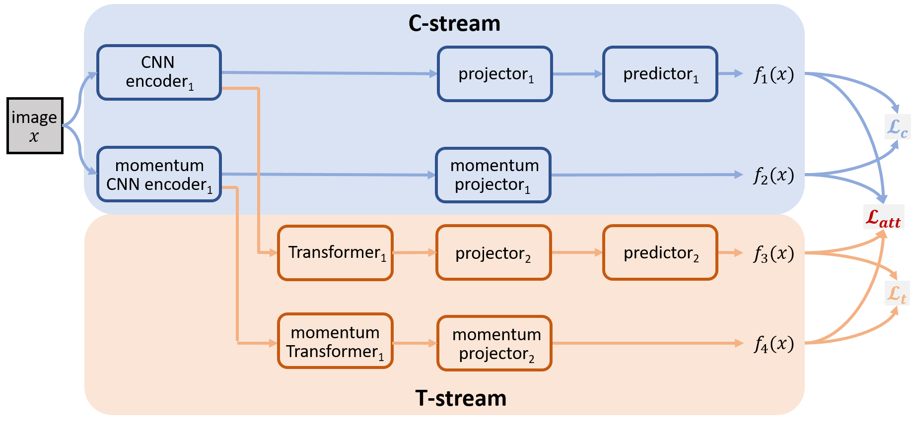

# CARE (NeurIPS 2021)

**[Revitalizing CNN Attention via Transformers in Self-Supervised Visual Representation Learning](https://arxiv.org/abs/2110.05340)**
<br>
[Chongjian GE](https://chongjiange.github.io/),
[Youwei Liang](https://youweiliang.github.io/),
[Yibing Song](https://ybsong00.github.io/),
[Jianbo Jiao](https://jianbojiao.com/),
[Jue Wang](https://juew.org/), and
[Ping Luo](http://luoping.me/)
<br>



## Updates
- (09/10/2021) Our paper is accepted by NeurIPS 2021. 
- (14/10/2021) Our code is available for ssl pretraining and image classification evaluation. 

## Comming
  - [x] Provide resnet_50(100e) models and logs.
  - [ ] Complete the pretrained models and logs.

## Requirements

To install requirements:

```setup
conda create -n care python=3.6
conda install pytorch==1.7.1 torchvision==0.8.2 torchaudio==0.7.2 cudatoolkit=10.1 -c pytorch
pip install tensorboardX
pip install ipdb
pip install einops
pip install loguru
pip install pyarrow==3.0.0
pip install imdb
pip install tqdm
```

>📋  Pytorch>=1.6 is needed for runing the code.
## Data Preparation

Prepare the ImageNet data in {data_path}/train.lmdb and {data_path}/val.lmdb

Relpace the original data path in care/data/dataset_lmdb (Line7 and Line40) with your new {data_path}.

>📋  Note that we use the lmdb file to speed-up the data-processing procedure.
>
>📋  We also provide code to load data with the single image(.jpg) format.

## Training

Before training the ResNet-50 (100 epoch) in the paper, run this command first to add your PYTHONPATH:

```train
export PYTHONPATH=$PYTHONPATH:{your_code_path}/care/
```

Then run the training code via:

```train
bash run_train.sh      #(The training script is used for trianing CARE with 8 gpus)
bash single_gpu_train.sh    #(We also provide the script for trainig CARE with only one gpu)
```

>📋  The training script is used to do unsupervised pre-training of a ResNet-50 model on ImageNet in an 8-gpu machine
>1. using `-b` to specify batch_size, e.g., `-b 128`
>2. using `-d` to specify gpu_id for training, e.g., `-d 0-7`
>3. using `--log_path`  to specify the main folder for saving experimental results.
>4. using `--experiment-name` to specify the folder for saving training outputs.
>
>The codebase also supports for training other backbones (e.g., ResNet101 and ResNet152) with different training schedules (e.g., 200, 400 and 800 epochs).
## Evaluation
Before start the evaluation, run this command first to add your PYTHONPATH:

```eval
export PYTHONPATH=$PYTHONPATH:{your_code_path}/care/
```

Then, to evaluate the pre-trained model (e.g., ResNet50-100epoch) on ImageNet, run:

```eval
bash run_val.sh      #(The training script is used for evaluating CARE with 8 gpus)
bash debug_val.sh    #(We also provide the script for evaluating CARE with only one gpu)
```

>📋  The training script is used to do the supervised linear evaluation of a ResNet-50 model on ImageNet in an 8-gpu machine
>1. using `-b` to specify batch_size, e.g., `-b 128`
>2. using `-d` to specify gpu_id for training, e.g., `-d 0-7`
>3. Modifying `--log_path`  according to your own config.
>4. Modifying `--experiment-name` according to your own config.

## Pre-trained Models

We here provide some pre-trained models in the [shared folder]:

Here are some examples.
- [ResNet-50 100epoch](https://drive.google.com/file/d/1cOBdLFwcBEAY-f8wKtWeYapK1hFgnbCD/view?usp=sharing) trained on ImageNet using ResNet-50 with 100 epochs.  [Training log](https://drive.google.com/file/d/1uEOSnh25sw5cxTxmLF7V-ku4sk25ZGtD/view?usp=sharing) and [Evaluation log](https://drive.google.com/file/d/1LL7H5zoTNBFRNcohlVnqyQzqlR1BLFGR/view?usp=sharing)
- [ResNet-50 200epoch] trained on ImageNet using ResNet-50 with 200 epochs. 
- [ResNet-50 400epoch] trained on ImageNet using ResNet-50 with 400 epochs. 

More models are provided in the following model zoo part.
>📋  We will provide more pretrained models in the future.
## Model Zoo

Our model achieves the following performance on :

### Self-supervised learning on image classifications.

| Method   | Backbone  | epoch |Top-1  | Top-5 | pretrained model  | linear evaluation model |
| ---------| --------- | ------|--------------- | -------------- | ----------------- | ----------------------- |
| CARE     | ResNet50  | 100   |    72.02%      |      90.02%    | [pretrained](https://drive.google.com/file/d/1cOBdLFwcBEAY-f8wKtWeYapK1hFgnbCD/view?usp=sharing) | [linear_model](https://drive.google.com/file/d/1cCVCmAjYTapjiSxP5N85_Hbdz1kPl4Rd/view?usp=sharing) |
| CARE     | ResNet50  | 200   |    73.78%      |      91.50%    | [pretrained] (wip) | [linear_model] (wip) |
| CARE     | ResNet50  | 400   |    74.68%      |      91.97%    | [pretrained] (wip) | [linear_model] (wip) |
| CARE     | ResNet50  | 800   |    75.56%      |      92.32%    | [pretrained] (wip) | [linear_model] (wip) |
| CARE     | ResNet50(2x) | 100   |    73.51%      |      91.66%    | [pretrained] (wip) | [linear_model] (wip) |
| CARE     | ResNet50(2x) | 200   |    75.00%      |      92.22%    | [pretrained] (wip) | [linear_model] (wip) |
| CARE     | ResNet50(2x) | 400   |    76.48%      |      92.99%    | [pretrained] (wip) | [linear_model] (wip) |
| CARE     | ResNet50(2x) | 800   |    77.04%      |      93.22%    | [pretrained] (wip) | [linear_model] (wip) |
| CARE     | ResNet101 | 100   |    73.54%      |      91.63%    | [pretrained] (wip)| [linear_model] (wip) |
| CARE     | ResNet101 | 200   |    75.89%      |      92.70%    | [pretrained] (wip) | [linear_model] (wip) |
| CARE     | ResNet101 | 400   |    76.85%      |      93.31%    | [pretrained] (wip) | [linear_model] (wip) |
| CARE     | ResNet101 | 800   |    77.23%      |      93.52%    | [pretrained] (wip) | [linear_model] (wip) |
| CARE     | ResNet152 | 100   |    74.59%      |      92.09%    | [pretrained] (wip) | [linear_model] (wip) |
| CARE     | ResNet152 | 200   |    76.58%      |      93.63%    | [pretrained] (wip) | [linear_model] (wip) |
| CARE     | ResNet152 | 400   |    77.40%      |      93.63%    | [pretrained] (wip) | [linear_model] (wip) |
| CARE     | ResNet152 | 800   |    78.11%      |      93.81%    | [pretrained] (wip)| [linear_model] (wip) |
### Transfer learning to object detection and semantic segmentation.
#### COCO det
| Method   | Backbone  | epoch | AP_bb | AP_50 | AP_75 | pretrained model  | det/seg model |
| ---------| --------- | ------|------ | -------- | -------- | ----------------- | ----------------------- |
| CARE     | ResNet50  | 200   | 39.4  |  59.2    |  42.6    | [pretrained] (wip) | [model] (wip) |
| CARE     | ResNet50  | 400   | 39.6  |  59.4    |  42.9    | [pretrained] (wip) | [model] (wip) |
| CARE | ResNet50-FPN  | 200   | 39.5  |  60.2    |  43.1    | [pretrained] (wip) | [model] (wip) |
| CARE | ResNet50-FPN  | 400   | 39.8  |  60.5    |  43.5    | [pretrained] (wip) | [model] (wip) |

#### COCO instance seg
| Method   | Backbone  | epoch | AP_mk | AP_50 | AP_75 | pretrained model  | det/seg model |
| ---------| --------- | ------|------ | -------- | -------- | ----------------- | ----------------------- |
| CARE     | ResNet50  | 200   | 34.6  |  56.1    |  36.8    | [pretrained] (wip) | [model] (wip) |
| CARE     | ResNet50  | 400   | 34.7  |  56.1    |  36.9    | [pretrained] (wip) | [model] (wip) |
| CARE | ResNet50-FPN  | 200   | 35.9  |  57.2    |  38.5    | [pretrained] (wip) | [model] (wip) |
| CARE | ResNet50-FPN  | 400   | 36.2  |  57.4    |  38.8    | [pretrained] (wip) | [model] (wip) |

#### VOC07+12 det
| Method   | Backbone  | epoch | AP_bb    | AP_50    | AP_75    | pretrained model  | det/seg model |
| ---------| --------- | ------|------ | -------- | -------- | ----------------- | ----------------------- |
| CARE     | ResNet50  | 200   | 57.7  |  83.0    |  64.5    | [pretrained] (wip) | [model] (wip) |
| CARE     | ResNet50  | 400   | 57.9  |  83.0    |  64.7    | [pretrained] (wip) | [model] (wip) |


>📋  More results are provided in the paper.
>
## Acknowledgements
We especially thank the contributors of the [momentum2-teacher](https://github.com/zengarden/momentum2-teacher) codebase for providing helpful code.

## Citation
If you think our work is useful, please feel free to cite our paper 😆 :
```
@article{ge2021revitalizing,
  title={Revitalizing CNN Attentions via Transformers in Self-Supervised Visual Representation Learning},
  author={Ge, Chongjian and Liang, Youwei and Song, Yibing and Jiao, Jianbo and Wang, Jue and Luo, Ping},
  journal={arXiv preprint arXiv:2110.05340},
  year={2021}
}
```


